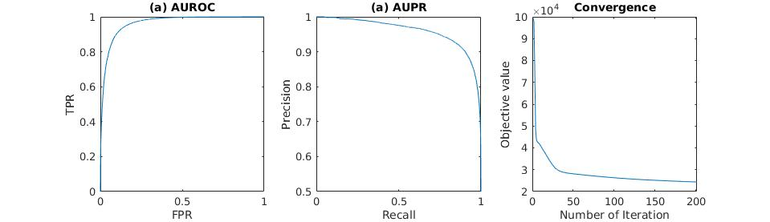

## iDrug: Integration of drug repositioning and drug-target prediction via cross-network embedding
iDrug is a computational pipeline to jointly predict novel drug-disease and drug-target interactions from heterogeneous network. iDrug adpot cross-network embedding to learn  low-dimensional feature space for drugs, targets, and diseases in the heterogeneous network.


### Code and data

#### Raw data
- `Drug-Disease Interactions`: the drug-disease interactions in form of `(DrugBankID, OMIMID)` was downloaded from CTD database (https://ctdbase.org/downloads/;jsessionid=0CF3C56EC170EF21331BFCDFA5E230C0).
- `Drug-Target Interactions`: the drug-target interactions in form of `(DrugBankID, UniprotID)` was downloaded from DrugBank database (https://www.drugbank.ca/releases/latest).
- `DiseaseName`: the disease name with `OMIMID` in the drug-disease domain.
- `DrugDomain1`: the drug name with `DrugBankID` in the drug-disease domain.
- `DrugDomain2`: the drug name with `DrugBankID` in the drug-target domain.
- `Target`: the target name with `UniprotID` in the drug-target domain.

#### Data in matlab form
- `DrugDisease.mat`: the drug-disease interactions.
- `DrugTarget.mat`: the drug-target interactions.
- `DrugSimMat1.mat`: the drug-drug similarity in drug-disease domain.
- `DrugSimMat2.mat`: the drug-drug similarity in drug-target domain.
- `DiseaseSimMat.mat`: the disease-disease similarity.
- `TargetSimMat.mat`: the target-target similarity.
- `SMat.mat`: the mapping matrix to denote the anchor links across the two domains.

#### Data visulization
- the histogram of similarity scores in drug-disease domain.


- the histogram of similarity scores in drug-target domain.


#### Code
- `iDrug`: the optimization algorithm for iDrug framework.
- `main.m`: demo code of running `iDrug.m`.
- `train_test_split.m`: split the data into training and test set.
- `auc.m`: evaluation script for AUROC and AUPR measurement.

#### Requirement
- The code is tested under `MATLAB2015b`.

#### Quick start
We provide an example script to run experiments on our dataset: 

- Run `main.m`: predict drug-disease interactions, and evaluate the results with cross-validation. 

```
matlab main(rank1, rank2, w, alpha, beta, gamma)
```
where (rank1, rank2, w, alpha, beta, gamma) are the parameters as described in the paper. The results are shown as



### Contacts
If you have any questions or comments, please feel free to email Huiyuan Chen (hxc501[at]case[dot]com).
