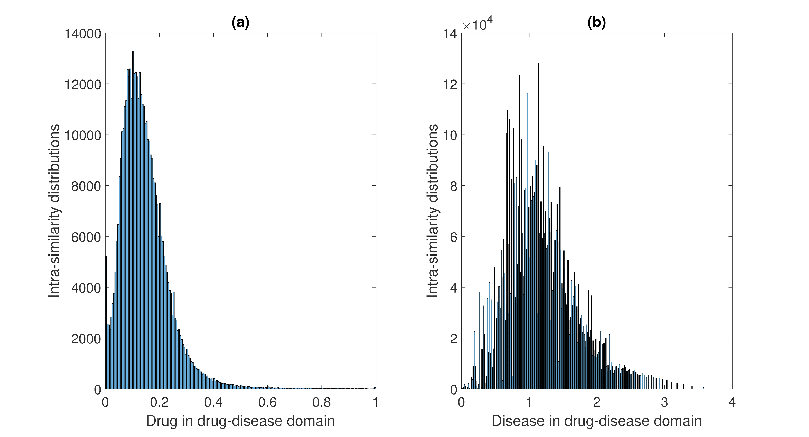
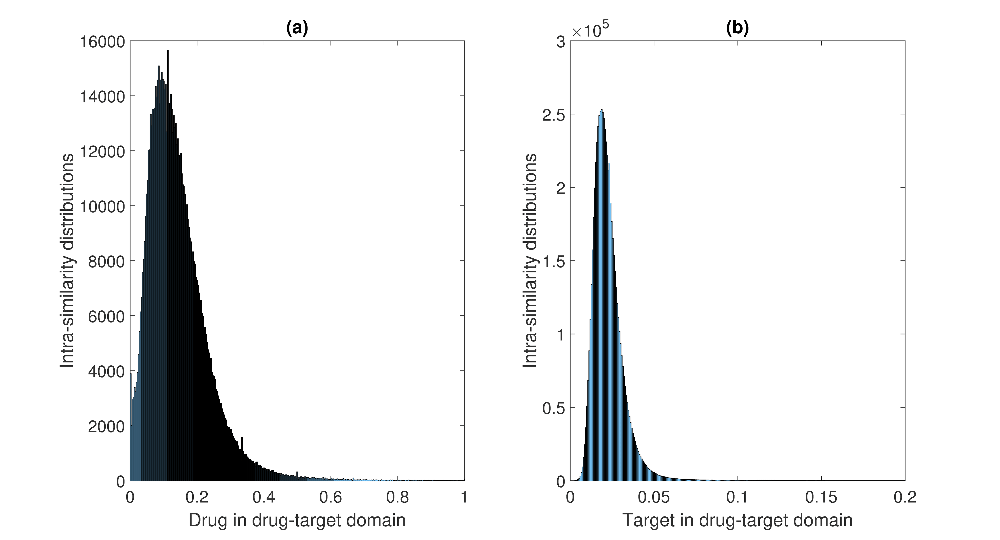

## iDrug: Integration of drug repositioning and drug-target prediction via cross-network embedding
iDrug is a computational pipeline to jointly predict novel drug-disease and drug-target interactions based on a heterogeneous network. iDrug adpots cross-network embedding to learn lower dimensional feature spaces for drugs, targets, and diseases in the heterogeneous network. A paper describing the approach is currently under review. A link to the paper will be added once it is published. 


### Code and data

#### Raw data 
- `Drug-Disease Interactions`: the drug-disease interactions in form of `(DrugBankID, OMIMID)` were downloaded from CTD database (https://ctdbase.org/downloads/;jsessionid=0CF3C56EC170EF21331BFCDFA5E230C0).
- `Drug-Target Interactions`: the drug-target interactions in form of `(DrugBankID, UniprotID)` were downloaded from DrugBank database (https://www.drugbank.ca/releases/latest).
- `DiseaseName`: disease names with their `OMIMID` in the drug-disease domain.
- `DrugDomain1`: drug names with their `DrugBankID` in the drug-disease domain.
- `DrugDomain2`: drug names with their `DrugBankID` in the drug-target domain.
- `Target`:  target names with their `UniprotID` in the drug-target domain.

#### Data in MatLab form 
- `DrugDisease.mat`: drug-disease interactions.
- `DrugTarget.mat`: drug-target interactions.
- `DrugSimMat1.mat`: drug-drug similarities in drug-disease domain.
- `DrugSimMat2.mat`: drug-drug similarities in drug-target domain.
- `DiseaseSimMat.mat`: disease-disease similarities.
- `TargetSimMat.mat`: target-target similarities.
- `SMat.mat`: the mapping matrix to denote the anchor links across the two domains.

#### Data visulization
- the histogram of similarity scores in the drug-disease domain.


- the histogram of similarity scores in the drug-target domain.


#### Code
- `iDrug.m`: the optimization algorithm for iDrug framework.
- `main.m`: demo code for running `iDrug.m`.
- `train_test_split.m`: split the data into training and testing sets.
- `auc.m`: evaluation script for AUROC and AUPR measurements.

#### Requirement
- The code is tested under `MATLAB2015b`.

#### Quick start
We provide an example script to run experiments on our datasets: 

- Users can run `main.m` to replicate results in the paper. 

```
matlab main(rank1, rank2, w, alpha, beta, gamma, DorT, scenario, k)
```
Among the parameters, `rank1` and `rank2` are the ranks of the latent matrices, `w` is the cost associated with the unobserved samples, and `(alpha, beta, gamma)` represent the contributions of within-domain smoothness, cross-network consistency, and the sparseness of solutions, respectively. The detail explanation of these parameters and sensitivity analysis can be found in the paper. The parameter `DorT` indicates whether the experiments will be for Drug-Disease (`DorT = '1'`) or Drug-target (`DorT = '2'`) prediction.  The parameter `scenario` indicates the one of the three possible scenarios in the paper: pair prediction (`scenario='1'`), new drug (`scenario='2'`), or new disease (`scenario='3'`), and the `k` is the top-k performance. 

To replicate drug-disease interaction prediction results using five-fold cross-validation in our paper, the values of these parameters are: `rank1 = 90`, `rank2 = 70`, `w = 0.3`, `alpha=beta=gamma= 0.001`, `DorT = '1'`, `scenario = '1'`. The results using these parameters are shown here:


For scenarios 2 and 3: `matlab main(70, 70, 0.3, 0.01, 0.01, 0.01, 1, '2', 20)` ====> `precision: 0.23`


#### Gold Standard Data
The Gold Standard datasets are located in the `./goldDataset/` directory and the same variable names are used to store the interactions and similarities. To obtain results from the gold starndard data, users just need to change their working directory to `./goldDataset/`.    

#### Run our program on users' data
Users just need to construct their data in Matlab format using the same name as outlined in the session "Data in MatLab form". 

### Links to some baselines:
- RLS-Kron: http://cs.ru.nl/~tvanlaarhoven/drugtarget2011/
- MBiRW: https://github.com//bioinfomaticsCSU/MBiRW
- GRMF and TH_HGBI: we implemented these two algorithms in MatLab in the files `GRMF.m` and `TH_HGBI.m` respectively.


### Contacts
If you have any questions or comments, please feel free to email Huiyuan Chen (hxc501[at]case[dot]com).
